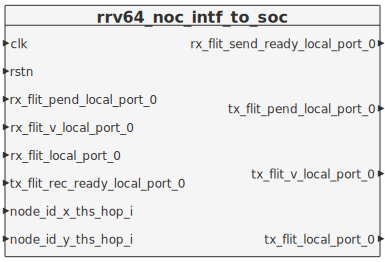
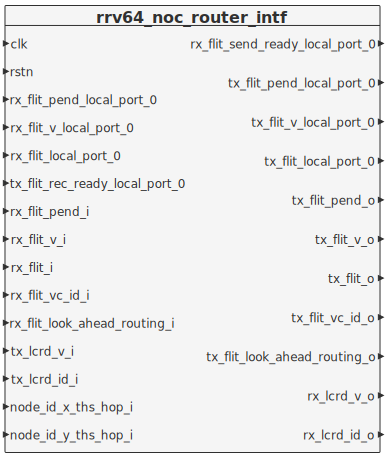

# 1 NoC to local device and SoC intf

## 1.1 Ports

| Name                            | Direction | Type                                  | Description                      |
| :------------------------------ | :-------- | :------------------------------------ | :------------------------------- |
| clk                             | in        | wire logic                            |                                  |
| rstn                            | in        | wire logic                            |                                  |
| rx_flit_pend_local_port_0       | in        | wire [CHANNEL_NUM-1:0] logic          | local port input                 |
| rx_flit_v_local_port_0          | in        | wire [CHANNEL_NUM-1:0] logic          | local port input                 |
| rx_flit_local_port_0            | in        | wire [CHANNEL_NUM-1:0] flit_payload_t | local port input                 |
| rx_flit_send_ready_local_port_0 | out       | [CHANNEL_NUM-1:0] logic               | credit based flow control signal |
| tx_flit_pend_local_port_0       | out       | [CHANNEL_NUM-1:0] logic               | local port output                |
| tx_flit_v_local_port_0          | out       | [CHANNEL_NUM-1:0] logic               | local port output                |
| tx_flit_local_port_0            | out       | [CHANNEL_NUM-1:0] flit_payload_t      | local port output                |
| tx_flit_rec_ready_local_port_0  | in        | wire [CHANNEL_NUM-1:0] logic          | credit based flow control signal |
| node_id_x_ths_hop_i             | in        | wire [NodeID_X_Width-1:0] logic       | router position                  |
| node_id_y_ths_hop_i             | in        | wire [NodeID_Y_Width-1:0] logic       | router position                  |

## 1.2 Diagram

# 2 NoC Router intf

## 2.1 Ports

| Name                            | Direction | Type                                                                        | Description                      |
| :------------------------------ | :-------- | :-------------------------------------------------------------------------- | :------------------------------- |
| clk                             | in        | wire logic                                                                  |                                  |
| rstn                            | in        | wire logic                                                                  |                                  |
| rx_flit_pend_local_port_0       | in        | wire [CHANNEL_NUM-1:0] logic                                                | local port input                 |
| rx_flit_v_local_port_0          | in        | wire [CHANNEL_NUM-1:0] logic                                                | local port input                 |
| rx_flit_local_port_0            | in        | wire [CHANNEL_NUM-1:0] flit_payload_t                                       | local port input                 |
| rx_flit_send_ready_local_port_0 | out       | [CHANNEL_NUM-1:0] logic                                                     | credit based flow control signal |
| tx_flit_pend_local_port_0       | out       | [CHANNEL_NUM-1:0] logic                                                     | local port output                |
| tx_flit_v_local_port_0          | out       | [CHANNEL_NUM-1:0] logic                                                     | local port output                |
| tx_flit_local_port_0            | out       | [CHANNEL_NUM-1:0] flit_payload_t                                            | local port output                |
| tx_flit_rec_ready_local_port_0  | in        | wire [CHANNEL_NUM-1:0] logic                                                | credit based flow control signal |
| rx_flit_pend_i                  | in        | wire [CHANNEL_NUM-1:0] [ROUTER_PORT_NUMBER-1:0] logic                       | router port input                |
| rx_flit_v_i                     | in        | wire [CHANNEL_NUM-1:0] [ROUTER_PORT_NUMBER-1:0] logic                       | router port input                |
| rx_flit_i                       | in        | wire [CHANNEL_NUM-1:0] [ROUTER_PORT_NUMBER-1:0] flit_payload_t              | router port input                |
| rx_flit_vc_id_i                 | in        | wire [CHANNEL_NUM-1:0] [ROUTER_PORT_NUMBER-1:0] [VC_ID_NUM_MAX_W-1:0] logic | router port input                |
| rx_flit_look_ahead_routing_i    | in        | wire [CHANNEL_NUM-1:0] [ROUTER_PORT_NUMBER-1:0] rvh_noc_pkg::io_port_t      | router port input                |
| tx_flit_pend_o                  | out       | [CHANNEL_NUM-1:0] [ROUTER_PORT_NUMBER-1:0] logic                            | router port output               |
| tx_flit_v_o                     | out       | [CHANNEL_NUM-1:0] [ROUTER_PORT_NUMBER-1:0] logic                            | router port output               |
| tx_flit_o                       | out       | [CHANNEL_NUM-1:0] [ROUTER_PORT_NUMBER-1:0] flit_payload_t                   | router port output               |
| tx_flit_vc_id_o                 | out       | [CHANNEL_NUM-1:0] [ROUTER_PORT_NUMBER-1:0] [VC_ID_NUM_MAX_W-1:0] logic      | router port output               |
| tx_flit_look_ahead_routing_o    | out       | [CHANNEL_NUM-1:0] [ROUTER_PORT_NUMBER-1:0] rvh_noc_pkg::io_port_t           | router port output               |
| rx_lcrd_v_o                     | out       | [CHANNEL_NUM-1:0] [ROUTER_PORT_NUMBER-1:0] logic                            | credit based flow control signal |
| rx_lcrd_id_o                    | out       | [CHANNEL_NUM-1:0] [ROUTER_PORT_NUMBER-1:0] [VC_ID_NUM_MAX_W-1:0] logic      | credit based flow control signal |
| tx_lcrd_v_i                     | in        | wire [CHANNEL_NUM-1:0] [ROUTER_PORT_NUMBER-1:0] logic                       | credit based flow control signal |
| tx_lcrd_id_i                    | in        | wire [CHANNEL_NUM-1:0] [ROUTER_PORT_NUMBER-1:0] [VC_ID_NUM_MAX_W-1:0] logic | credit based flow control signal |
| node_id_x_ths_hop_i             | in        | wire [NodeID_X_Width-1:0] logic                                             | router position                  |
| node_id_y_ths_hop_i             | in        | wire [NodeID_Y_Width-1:0] logic                                             | router position                  |

## 2.2 Diagram

