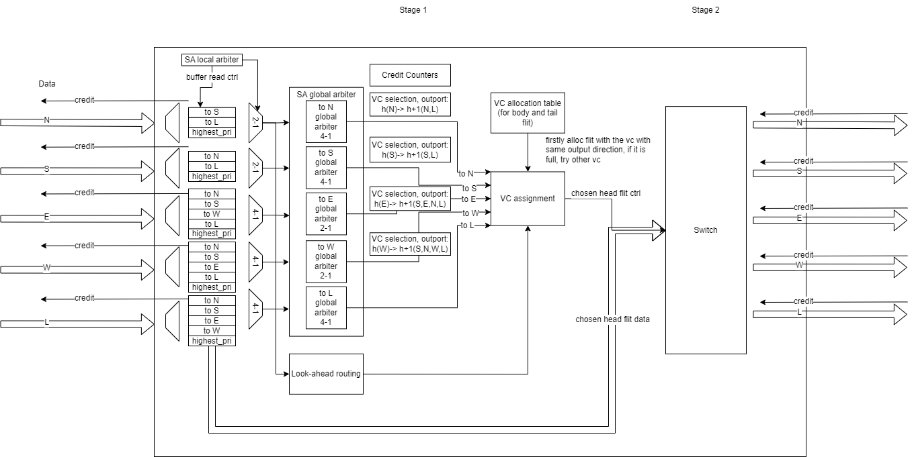

# NoC Spec

## 1 Interface
This NoC uses CHI compatible interface. It defines 4 channels for different kinds of messages. Each channel is implemented in a specific physical sub-networks, so the NoC has 4 sub-networks. 
Each router can be configured to have 0~4 local port(s).

### 1.1 Channel

In this specification, the Link layer provides a set of channels for flit communication.

Each channel has a defined flit format that has multiple fields and some of the field widths have multiple possible values. In some cases, the defined flit format can be used on both an inbound and an outbound channel.

Table 1 shows the channels, and the mapping onto the Request Node, Home Node and Subordinate Node component channels.

| Channel | Description                                                                                                                                 | Usage                                                           | RN Channel | HN Channel | SN Channel |
| ------- | ------------------------------------------------------------------------------------------------------------------------------------------- | --------------------------------------------------------------- | ---------- | ---------- | ---------- |
| REQ     | The request channel transfers flits associated with request messages such as Read requests and Write requests.                              | Requests from RN to HN                                          | TXREQ      | RXREQ      | -          |
|         |                                                                                                                                             | Requests from RN to SN                                          | TXREQ      | -          | RXREQ      |
|         |                                                                                                                                             | Requests from HN to SN                                          | -          | TXREQ      | RXREQ      |
| RSP     | The response channel transfers flits associated with response messages that do not have a data payload such as write completion messages.   | Responses from SN to HN                                         | -          | RXRSP      | TXRSP      |
|         |                                                                                                                                             | Responses from SN to RN                                         | RXRSP      |            | TXRSP      |
|         |                                                                                                                                             | Responses from HN to RN                                         | RXRSP      | TXRSP      | -          |
|         |                                                                                                                                             | Snoop Response and Completion Acknowledge from snoopee RN to HN | TXRSP      | RXRSP      | -          |
| SNP     | The snoop channel transfers flits associated with Snoop Request messages.                                                                   | Snoop Requests from HN to snoopee RN                            | RXSNP      | TXSNP      | -          |
| DAT     | The data channel transfers flits associated with protocol messages that have a data payload such as read completion and WriteData messages. | WriteData, and Snoop response data from an RN to HN             | TXDAT      | RXDAT      | -          |
|         |                                                                                                                                             | WriteData from an RN to SN                                      | TXDAT      | -          | RXDAT      |
|         |                                                                                                                                             | WriteData from an HN to SN                                      | -          | TXDAT      | RXDAT      |
|         |                                                                                                                                             | Read data from SN to RN                                         | RXDAT      | -          | TXDAT      |
|         |                                                                                                                                             | Read data from SN to HN                                         | -          | RXDAT      | TXDAT      |
|         |                                                                                                                                             | Read data from HN to RN                                         | RXDAT      | TXDAT      | -          |

Table 2 shows the channels of Request Node, Home Node and Subordinate Node component have.

| Component | TXREQ | RXREQ | TXRSP | RXRSP | TXSNP | RXSNP | TXDAT | RXDAT |
| --------- | ----- | ----- | ----- | ----- | ----- | ----- | ----- | ----- |
| RN        | Y     | -     | Y     | Y     | -     | Y     | Y     | Y     |
| HN        | Y     | Y     | Y     | Y     | Y     | -     | Y     | Y     |
| SN        | -     | Y     | Y     | -     | -     | -     | Y     | Y     |

// TODO: RN need RXREQ to receive core to core interrupt

### 1.2 Port

Table 3 shows the links of each router (and channel) port.

| Name                         | Direction | Type                                                   | Description                                        |
| :--------------------------- | :-------- | :----------------------------------------------------- | :------------------------------------------------- |
| rx_flit_pend_i               | in        | wire [INPUT_PORT_NUM-1:0] logic                        | input from other router or local port // N,S,E,W,L |
| rx_flit_v_i                  | in        | wire [INPUT_PORT_NUM-1:0] logic                        |                                                    |
| rx_flit_i                    | in        | wire [INPUT_PORT_NUM-1:0] flit_payload_t               |                                                    |
| rx_flit_vc_id_i              | in        | wire [INPUT_PORT_NUM-1:0] [VC_ID_NUM_MAX_W-1:0] logic  |                                                    |
| rx_flit_look_ahead_routing_i | in        | wire [INPUT_PORT_NUM-1:0] rvh_noc_pkg::io_port_t       |                                                    |
| tx_flit_pend_o               | out       | [OUTPUT_PORT_NUM-1:0] logic                            | output to other router or local port // N,S,E,W,L  |
| tx_flit_v_o                  | out       | [OUTPUT_PORT_NUM-1:0] logic                            |                                                    |
| tx_flit_o                    | out       | [OUTPUT_PORT_NUM-1:0] flit_payload_t                   |                                                    |
| tx_flit_vc_id_o              | out       | [OUTPUT_PORT_NUM-1:0] [VC_ID_NUM_MAX_W-1:0] logic      |                                                    |
| tx_flit_look_ahead_routing_o | out       | [OUTPUT_PORT_NUM-1:0] rvh_noc_pkg::io_port_t           |                                                    |
| rx_lcrd_v_o                  | out       | [INPUT_PORT_NUM-1:0] logic                             | free VC credit sent to sender                      |
| rx_lcrd_id_o                 | out       | [INPUT_PORT_NUM-1:0] [VC_ID_NUM_MAX_W-1:0] logic       |                                                    |
| tx_lcrd_v_i                  | in        | wire [OUTPUT_PORT_NUM-1:0] logic                       | free VC credit received from receiver              |
| tx_lcrd_id_i                 | in        | wire [OUTPUT_PORT_NUM-1:0] [VC_ID_NUM_MAX_W-1:0] logic |                                                    |
| node_id_x_ths_hop_i          | in        | wire [NodeID_X_Width-1:0] logic                        | router addr                                        |
| node_id_y_ths_hop_i          | in        | wire [NodeID_Y_Width-1:0] logic                        |                                                    |
| clk                          | in        | wire logic                                             |                                                    |
| rstn                         | in        | wire logic                                             |                                                    |

### 1.3 Flit packet definitions

Refer to IHI0050F_amba_chi_architecture_spec Flit packet definitions. This part illustrates the definition of the variable length portion of the CHI flit for this design.
#### 1.3.1 Request flit

| Field                   | Field width                       | Comment                                   |
| ----------------------- | --------------------------------- | ----------------------------------------- |
| QoS                     | 4                                 | -                                         |
| TgtID                   | 7                                 | Width determined by NodeID_Width          |
| SrcID                   | 7                                 | Width determined by NodeID_Width          |
| TxnID                   | 12                                | -                                         |
| ReturnNID or            | 7                                 | Used for DMT                              |
| StashNID or             |                                   | Used in Stash transactions                |
| {(NodeID_Width - 7)'b0, |                                   | SBZ                                       |
| SLCRepHint[6:0]}        |                                   | Used in cache line replacement algorithms |
| StashNIDValid           | 1                                 | Used in Stash transactions                |
| Endian                  |                                   | Used in Atomic transactions               |
| Deep                    |                                   | Used in CleanSharedPersist* transactions  |
| ReturnTxnID[11:0]       | 12                                | Used for DMT                              |
| {6'b0,                  |                                   | SBZ                                       |
| StashLPIDValid,         |                                   | Used in Stash transactions                |
| StashLPID[4:0]}         |                                   | Used in Stash transactions                |
| Opcode                  | 7                                 | -                                         |
| Size                    | 3                                 | -                                         |
| Addr                    | RAW = 44 to 52                    | Width determined by Req_Addr_Width (RAW)  |
| NS                      | 1                                 | -                                         |
| NSE                     | 1                                 | -                                         |
| LikelyShared            | 1                                 | -                                         |
| AllowRetry              | 1                                 | -                                         |
| Order                   | 2                                 | -                                         |
| PCrdType                | 4                                 | -                                         |
| MemAttr                 | 4                                 | -                                         |
| SnpAttr or              | 1                                 | -                                         |
| DoDWT                   |                                   | Used for DWT                              |
| PGroupID[7:0] or        | 8                                 | Used in Persistent CMO transactions       |
| StashGroupID[7:0] or    |                                   | Used in the StashOnceSep transaction      |
| TagGroupID[7:0] or      |                                   | Used for Memory Tagging                   |
| {3'b0,                  |                                   | SBZ                                       |
| LPID[4:0]}              |                                   | -                                         |
| Excl                    | 1                                 | Used in Exclusive transactions            |
| SnoopMe                 |                                   | Used in Atomic transactions               |
| CAH                     |                                   | Used in CopyBack Write transactions       |
| ExpCompAck              | 1                                 | -                                         |
| TagOp                   | 2                                 | -                                         |
| TraceTag                | 1                                 | -                                         |
| MPAM                    | M = 0                             | No MPAM bus                               |
|                         | M = 12                            | -                                         |
| PBHA                    | PB = 0                            | No PBHA bus                               |
|                         | PB = 4                            | -                                         |
| RSVDC                   | Y = 0                             | No RSVDC bus                              |
|                         | Y = 4, 8, 12, 16, 24, 32          | -                                         |
| Total                   | R = (88 + RAW + Y + M + PB) = 132 | RAW = 44, Y = 0, M = 0, PB = 0            |


#### 1.3.2 Response flit

| Field                 | Field width | Comment                             |
| --------------------- | ----------- | ----------------------------------- |
| QoS                   | 4           | -                                   |
| TgtID                 | 7           | Width determined by NodeID_Width    |
| SrcID                 | 7           | Width determined by NodeID_Width    |
| TxnID                 | 12          | -                                   |
| Opcode                | 5           | -                                   |
| RespErr               | 2           | -                                   |
| Resp                  | 3           | -                                   |
| FwdState[2:0] or      | 3           | Used for DCT                        |
| DataPull[2:0]         |             | Used in Stash transactions          |
| CBusy                 | 3           | -                                   |
| DBID[11:0] or         | 12          | -                                   |
| {4'b0,                |             | SBZ                                 |
| PGroupID[7:0]} or     |             | Used in Persistent CMO transactions |
| {4'b0,                |             | SBZ                                 |
| StashGroupID[7:0]} or |             | Used in Stash transactions          |
| {4'b0,                |             | SBZ                                 |
| TagGroupID[7:0]}      |             | Used for Memory Tagging             |
| PCrdType              | 4           | -                                   |
| TagOp                 | 2           | -                                   |
| TraceTag              | 1           | -                                   |
| Total                 | T = 65      | -                                   |

#### 1.3.3 Snoop flit

| Field                  | Field width             | Comment                          |
| ---------------------- | ----------------------- | -------------------------------- |
| QoS                    | 4                       | -                                |
| SrcID                  | 7                       | Width determined by NodeID_Width |
| TxnID                  | 12                      | -                                |
| FwdNID or              | 7                       | Width determined by NodeID_Width |
| {(NodeID_Width - 4)'0, |                         |                                  |
| PBHA[3:0]}             |                         |                                  |
| FwdTxnID[11:0] or      | 12                      | Used for DCT                     |
| {6'b0,                 |                         | SBZ                              |
| StashLPIDValid         |                         | Used in Stash transactions       |
| StashLPID[4:0]} or     |                         | Used in Stash transactions       |
| {4'b0,                 |                         | SBZ                              |
| VMIDExt[7:0]}          |                         | Used in DVM transactions         |
| Opcode                 | 5                       | -                                |
| Addr                   | SAW = 41 to 49          | Req_Addr_Width - 3               |
| NS                     | 1                       | -                                |
| NSE                    | 1                       | -                                |
| DoNotGoToSD            | 1                       | -                                |
| RetToSrc               | 1                       | -                                |
| TraceTag               | 1                       | -                                |
| MPAM                   | M = 0                   | No MPAM bus                      |
|                        | M = 11                  | -                                |
| Total                  | S = (52 + SAW + M) = 93 | SAW = 41, M = 0                  |

#### 1.3.4 Data flit

| Field                   | Field width                   | Comment                             |
| ----------------------- | ----------------------------- | ----------------------------------- |
| QoS                     | 4                             | -                                   |
| TgtID                   | 7                             | Width determined by NodeID_Width    |
| SrcID                   | 7                             | Width determined by NodeID_Width    |
| TxnID                   | 12                            | -                                   |
| HomeNID or              | 7                             | Width determined by NodeID_Width    |
| {(NodeID_Width - 4)'b0, |                               |                                     |
| PBHA[3:0]}              |                               |                                     |
| Opcode                  | 4                             | -                                   |
| RespErr                 | 2                             | -                                   |
| Resp                    | 3                             | -                                   |
| DataSource[4:0] or      | 5                             | Indicates Data source in a response |
| {2'b0,                  |                               | SBZ                                 |
| FwdState[2:0]} or       |                               | Used for DCT                        |
| {2'b0,                  |                               | SBZ                                 |
| DataPull[2:0]}          |                               | Used in Stash transactions          |
| CBusy                   | 3                             | -                                   |
| DBID[11:0]              | 12                            | -                                   |
| CCID                    | 2                             | -                                   |
| DataID                  | 2                             | -                                   |
| TagOp                   | 2                             | -                                   |
| Tag                     | DW/32 = 4, 8, 16              | -                                   |
| TU                      | DW/128 = 1, 2, 4              | -                                   |
| TraceTag                | 1                             | -                                   |
| CAH                     | 1                             | -                                   |
| RSVDC                   | Y = 0                         | No RSVDC bus                        |
|                         | Y = 4, 8, 12, 16, 24, 32      | -                                   |
| BE                      | DW/8 = 16, 32, 64             | -                                   |
| Data                    | DW = 128, 256, 512            | DW = Data bus width                 |
| DataCheck (DC)          | 0 or DW/8 = 16, 32, 64        | -                                   |
| Poison (P)              | 0 or DW/64 = 2, 4, 8          | -                                   |
| Total                   | D = (223 to 235) + Y + DC + P | DW = 128 bit Data                   |
|                         | D = (372 to 384) + Y + DC + P | DW = 256 bit Data                   |
|                         | D = (670 to 682) + Y + DC + P | DW = 512 bit Data                   |
|                         | D = 223 + Y + DC + P = 223    | DW = 128, Y = 0, DC = 0, P = 0      |
|                         | D = 372 + Y + DC + P = 372    | DW = 128, Y = 0, DC = 0, P = 0      |


## 2 Parameters and Configuations

There are some parameters and configuations to set.

### 2.1 NoC Configuations

Table 4 shows configuations for overall NoC.

| Name                           | Type   | Default Value | Description                                                                           |
| :----------------------------- | :----- | :------------ | :------------------------------------------------------------------------------------ |
| HAVE_LOCAL_PORT                | define | defined       | The router have local port(s)                                                         |
| LOCAL_PORT_NUM_2               | define | undefined     | The router have >= 2 local ports                                                      |
| LOCAL_PORT_NUM_3               | define | undefined     | The router have >= 3 local ports                                                      |
| LOCAL_PORT_NUM_4               | define | undefined     | The router have 4 local ports                                                         |
| VC_DATA_USE_DUAL_PORT_RAM      | define | undefined     | Use unified dual-port ram per input port VC data buffer (default: separate dff fifo)  |
| RETURN_CREDIT_AT_SA_STAGE      | define | undefined     | Reture credit to send at sa stage rather than st atage                                |
| ALLOW_SAME_ROUTER_L2L_TRANSFER | define | undefined     | Allow local ports in same router transfer flit, at least 2 local ports                |
| COMMON_QOS                     | define | undefined     | QoS, no special VC, all VC head flits ranked by QoS value                             |
| COMMON_QOS_EXTRA_RT_VC         | define | defined       | QoS, add special VC for highest priority flits, all VC head flits ranked by QoS value |

### 2.2 NoC Parameters

Table 5 shows parameters for overall NoC.

| Name                      | Type | Default Value                                                                       | Description                                  |
| :------------------------ | :--- | :---------------------------------------------------------------------------------- | :------------------------------------------- |
| CHANNEL_NUM               | int  | 4                                                                                   | 4 channels: req, resp, data, snp             |
| NodeID_X_Width            | int  | 2                                                                                   |                                              |
| NodeID_Y_Width            | int  | 3                                                                                   |                                              |
| NodeID_Device_Port_Width  | int  | 2                                                                                   |                                              |
| NodeID_Device_Id_Width    | int  | 1                                                                                   |                                              |
| NodeID_Width              | int  | NodeID_X_Width + NodeID_Y_Width + NodeID_Device_Port_Width + NodeID_Device_Id_Width |                                              |
| TxnID_Width               | int  | 12                                                                                  |                                              |
| QoS_Value_Width           | int  | 4                                                                                   |                                              |
| FLIT_LENGTH               | int  | 256                                                                                 | per channel refer to flit definitation       |
| INPUT_PORT_NUMBER         | int  | 5                                                                                   |                                              |
| INPUT_PORT_NUMBER_IDX_W   | int  | INPUT_PORT_NUMBER > 1 ? $clog2(INPUT_PORT_NUMBER) : 1                               |                                              |
| OUTPUT_PORT_NUMBER        | int  | 5                                                                                   |                                              |
| ROUTER_PORT_NUMBER        | int  | 4                                                                                   | 4 ports connect to other routers: N, S, E, W |
| LOCAL_PORT_NUMBER         | int  | INPUT_PORT_NUMBER-4                                                                 | Ports connect to local device(s)             |
| QOS_VC_NUM_PER_INPUT      | int  | 1                                                                                   |                                              |
| VC_ID_NUM_MAX             | int  | (CHANNEL_NUM-1)+LOCAL_PORT_NUMBER+QOS_VC_NUM_PER_INPUT                              |                                              |
| VC_ID_NUM_MAX_W           | int  | VC_ID_NUM_MAX > 1 ? $clog2(VC_ID_NUM_MAX) : 1                                       |                                              |
| SA_GLOBAL_INPUT_NUM_MAX   | int  | (CHANNEL_NUM-1)+LOCAL_PORT_NUMBER                                                   |                                              |
| SA_GLOBAL_INPUT_NUM_MAX_W | int  | SA_GLOBAL_INPUT_NUM_MAX > 1 ? $clog2(SA_GLOBAL_INPUT_NUM_MAX) : 1                   |                                              |
| VC_DEPTH_MAX              | int  | 4                                                                                   |                                              |
| VC_DPRAM_DEPTH_MAX        | int  | VC_ID_NUM_MAX * VC_DEPTH_MAX                                                        |                                              |
| VC_BUFFER_DEPTH_MAX_W     | int  | VC_DEPTH_MAX > 1 ? $clog2(VC_DEPTH_MAX) : 1                                         |                                              |
| VC_DPRAM_DEPTH_MAX_W      | int  | VC_DPRAM_DEPTH_MAX > 1 ? $clog2(VC_DPRAM_DEPTH_MAX) : 1                             |                                              |


### 2.3 Router Parameters

Table 6 shows parameters for each router instance, the default values are likely to be overwrite by NoC parameters.

| Name                        | Type           | Default Value                                                 | Description             |
| :-------------------------- | :------------- | :------------------------------------------------------------ | :---------------------- |
| INPUT_PORT_NUM              | int            | 5                                                             |                         |
| OUTPUT_PORT_NUM             | int            | 5                                                             |                         |
| LOCAL_PORT_NUM              | int            | INPUT_PORT_NUM-4                                              |                         |
| flit_payload_t              | flit_payload_t | logic[256-1:0]                                                |                         |
| QOS_VC_NUM_PER_INPUT        | int            | 0                                                             |                         |
| VC_NUM_INPUT_N              | int            | 1+LOCAL_PORT_NUM+QOS_VC_NUM_PER_INPUT                         |                         |
| VC_NUM_INPUT_S              | int            | 1+LOCAL_PORT_NUM+QOS_VC_NUM_PER_INPUT                         |                         |
| VC_NUM_INPUT_E              | int            | 3+LOCAL_PORT_NUM+QOS_VC_NUM_PER_INPUT                         |                         |
| VC_NUM_INPUT_W              | int            | 3+LOCAL_PORT_NUM+QOS_VC_NUM_PER_INPUT                         |                         |
| VC_NUM_INPUT_L              | int            | 4+LOCAL_PORT_NUM-1+QOS_VC_NUM_PER_INPUT                       |                         |
| VC_NUM_INPUT_N_IDX_W        | int            | VC_NUM_INPUT_N > 1 ? $clog2(VC_NUM_INPUT_N) : 1               |                         |
| VC_NUM_INPUT_S_IDX_W        | int            | VC_NUM_INPUT_S > 1 ? $clog2(VC_NUM_INPUT_S) : 1               |                         |
| VC_NUM_INPUT_E_IDX_W        | int            | VC_NUM_INPUT_E > 1 ? $clog2(VC_NUM_INPUT_E) : 1               |                         |
| VC_NUM_INPUT_W_IDX_W        | int            | VC_NUM_INPUT_W > 1 ? $clog2(VC_NUM_INPUT_W) : 1               |                         |
| VC_NUM_INPUT_L_IDX_W        | int            | VC_NUM_INPUT_L > 1 ? $clog2(VC_NUM_INPUT_L) : 1               |                         |
| SA_GLOBAL_INPUT_NUM_N       | int            | 3+LOCAL_PORT_NUM                                              |                         |
| SA_GLOBAL_INPUT_NUM_S       | int            | 3+LOCAL_PORT_NUM                                              |                         |
| SA_GLOBAL_INPUT_NUM_E       | int            | 1+LOCAL_PORT_NUM                                              |                         |
| SA_GLOBAL_INPUT_NUM_W       | int            | 1+LOCAL_PORT_NUM                                              |                         |
| SA_GLOBAL_INPUT_NUM_L       | int            | 4+LOCAL_PORT_NUM-1                                            |                         |
| SA_GLOBAL_INPUT_NUM_N_IDX_W | int            | SA_GLOBAL_INPUT_NUM_N > 1 ? $clog2(SA_GLOBAL_INPUT_NUM_N) : 1 |                         |
| SA_GLOBAL_INPUT_NUM_S_IDX_W | int            | SA_GLOBAL_INPUT_NUM_S > 1 ? $clog2(SA_GLOBAL_INPUT_NUM_S) : 1 |                         |
| SA_GLOBAL_INPUT_NUM_E_IDX_W | int            | SA_GLOBAL_INPUT_NUM_E > 1 ? $clog2(SA_GLOBAL_INPUT_NUM_E) : 1 |                         |
| SA_GLOBAL_INPUT_NUM_W_IDX_W | int            | SA_GLOBAL_INPUT_NUM_W > 1 ? $clog2(SA_GLOBAL_INPUT_NUM_W) : 1 |                         |
| SA_GLOBAL_INPUT_NUM_L_IDX_W | int            | SA_GLOBAL_INPUT_NUM_L > 1 ? $clog2(SA_GLOBAL_INPUT_NUM_L) : 1 |                         |
| VC_NUM_OUTPUT_N             | int            | 1+LOCAL_PORT_NUM+QOS_VC_NUM_PER_INPUT                         |                         |
| VC_NUM_OUTPUT_S             | int            | 1+LOCAL_PORT_NUM+QOS_VC_NUM_PER_INPUT                         |                         |
| VC_NUM_OUTPUT_E             | int            | 3+LOCAL_PORT_NUM+QOS_VC_NUM_PER_INPUT                         |                         |
| VC_NUM_OUTPUT_W             | int            | 3+LOCAL_PORT_NUM+QOS_VC_NUM_PER_INPUT                         |                         |
| VC_NUM_OUTPUT_L             | int            | 1                                                             | VC number in local node |
| VC_NUM_OUTPUT_N_IDX_W       | int            | VC_NUM_OUTPUT_N > 1 ? $clog2(VC_NUM_OUTPUT_N) : 1             |                         |
| VC_NUM_OUTPUT_S_IDX_W       | int            | VC_NUM_OUTPUT_S > 1 ? $clog2(VC_NUM_OUTPUT_S) : 1             |                         |
| VC_NUM_OUTPUT_E_IDX_W       | int            | VC_NUM_OUTPUT_E > 1 ? $clog2(VC_NUM_OUTPUT_E) : 1             |                         |
| VC_NUM_OUTPUT_W_IDX_W       | int            | VC_NUM_OUTPUT_W > 1 ? $clog2(VC_NUM_OUTPUT_W) : 1             |                         |
| VC_NUM_OUTPUT_L_IDX_W       | int            | VC_NUM_OUTPUT_L > 1 ? $clog2(VC_NUM_OUTPUT_L) : 1             |                         |
| VC_DEPTH_INPUT_N            | int            | 2                                                             |                         |
| VC_DEPTH_INPUT_S            | int            | 2                                                             |                         |
| VC_DEPTH_INPUT_E            | int            | 2                                                             |                         |
| VC_DEPTH_INPUT_W            | int            | 2                                                             |                         |
| VC_DEPTH_INPUT_L            | int            | 2                                                             |                         |
| VC_DEPTH_OUTPUT_N           | int            | VC_DEPTH_INPUT_N                                              |                         |
| VC_DEPTH_OUTPUT_S           | int            | VC_DEPTH_INPUT_S                                              |                         |
| VC_DEPTH_OUTPUT_E           | int            | VC_DEPTH_INPUT_E                                              |                         |
| VC_DEPTH_OUTPUT_W           | int            | VC_DEPTH_INPUT_W                                              |                         |
| VC_DEPTH_OUTPUT_L           | int            | VC_DEPTH_INPUT_L                                              |                         |
| VC_DEPTH_OUTPUT_N_COUNTER_W | int            | $clog2(VC_DEPTH_OUTPUT_N + 1)                                 |                         |
| VC_DEPTH_OUTPUT_S_COUNTER_W | int            | $clog2(VC_DEPTH_OUTPUT_S + 1)                                 |                         |
| VC_DEPTH_OUTPUT_E_COUNTER_W | int            | $clog2(VC_DEPTH_OUTPUT_E + 1)                                 |                         |
| VC_DEPTH_OUTPUT_W_COUNTER_W | int            | $clog2(VC_DEPTH_OUTPUT_W + 1)                                 |                         |
| VC_DEPTH_OUTPUT_L_COUNTER_W | int            | $clog2(VC_DEPTH_OUTPUT_L + 1)                                 |                         |


## 3 Topology

Configurable 2D mesh topology, the default topology in `tb_mesh.sv` and `top_mesh_syn.sv` is a 3x3 2D mesh.

```
    NoC Topology

     (0,2) -- (1,2) -- (2,2)
       | \      | \      | \
       |  rn5   |  rn6   |  rn7
     (0,1) -- (1,1) -- (2,1)
       | \      | \      | \
       |  rn2   |  rn3   |  rn4
     (0,0) -- (1,0) -- (2,0)
         \        \        \
          rn0      hn0      rn1
```

## 4 Routing

Use X-Y routing: 

Routing directions are referred to by the mesh port that the NoC routes the flit through. For
example, if the NoC routes the flit northwards, then the flit is sent through the north mesh port.

If there is a mismatch between the target NoC XID and the current NoC XID, then the NoC uses
the following rule to decide the routing direction:

  * If target NoC XID > current NoC XID, then route eastwards
  * Otherwise, route westwards

If the target NoC XID and the current NoC XID match, then the flit routing components are
compared against the YID of the NoC. If YIDs do not match, then the NoC uses the following rule
to decide the routing direction:

  * If target NoC YID > current NoC YID, then route northwards
  * Otherwise, route southwards

If the target NoC XID and YID match the current NoC XID and YID, then the flit has reached the
target NoC. At this point, the flit is downloaded to the target device.

## 5 Flow Control

A flow-control mechanism by which the transmitting device uses link layer credits to send
NoC flits – one credit per flit. In turn, the receiving device sends these credits back to the
transmitting device, one at a time, when it is done processing each flit to allow for subsequent
flit transfers.

## 6 Router Microarchitecture



Features:
* 2-stage pipeline.
* credited-based flow control.
* Vitrual channel(VC) for QoS and switch allocation efficiency.
* The allocation priority of VC is based on look-ahead routing result.
* 2-level switch allocation, based on fair round-robin algorithm.
* Look-ahead routing for next hop router for better timing and VC allocation.
* Decoupled VC selection from VC allocation for better timing.

### 6.1 Routing Algorithm
Use XY routing, the routing result is calculated one hop ahead, which is look-ahead routing

#### 6.1.1 XY Routing
Flits firstly go through X axis, then go though Y axis:
```
  1st phase: Assign next address
  2nd phase: Define new Next-port
```
#### 6.1.2 Look-ahead Routing

The routing result is calculated at last hop router or local onput port, to achieve better timing and VC allocation.

### 6.2 Input Port

#### 6.2.1 Input VC

1. Use Fixed VC Assignment with Dynamic VC Allocation (FVADA) [paper](https://sites.pitt.edu/~juy9/papers/Yi-HPCA10.pdf) VC allocation mechanism. The input VCs are associated with the flits' output port.
2. XY routing, so some of the output port are not used in some input ports.

* VC in each input port:

| input port | input port id | VC id | priority be assigned output port | output port id |
| ---------- | ------------- | ----- | -------------------------------- | -------------- |
| N          | 0             | 0     | S                                | 1              |
|            |               | 1     | L                                | 4              |
| S          | 1             | 0     | N                                | 0              |
|            |               | 1     | L                                | 4              |
| E          | 2             | 0     | N                                | 0              |
|            |               | 1     | S                                | 1              |
|            |               | 2     | W                                | 3              |
|            |               | 3     | L                                | 4              |
| W          | 3             | 0     | N                                | 0              |
|            |               | 1     | S                                | 1              |
|            |               | 2     | E                                | 2              |
|            |               | 3     | L                                | 4              |
| L          | 4             | 0     | N                                | 0              |
|            |               | 1     | S                                | 1              |
|            |               | 2     | E                                | 2              |
|            |               | 3     | W                                | 3              |


### 6.3 Switch Allocation

Use two-stage input-port-first allocation.

#### 6.3.1 Local allocation
Use round-robin arbition. As XY routing, the local arbiters' input port number are not the same.

#### 6.3.2 Global allocation

Use round-robin arbition. As XY routing, the global arbiters' input port number are not the same.

* input output port mapping for each SA global arbiter:

| output port | global SA arbiter connected input ports | global SA arbiter connected input ports id | next hop input port |
| ----------- | --------------------------------------- | ------------------------------------------ | ------------------- |
| N           | S                                       | 1                                          | S                   |
|             | E                                       | 2                                          |                     |
|             | W                                       | 3                                          |                     |
|             | L                                       | 4                                          |                     |
| S           | N                                       | 0                                          | N                   |
|             | E                                       | 2                                          |                     |
|             | W                                       | 3                                          |                     |
|             | L                                       | 4                                          |                     |
| E           | W                                       | 3                                          | W                   |
|             | L                                       | 4                                          |                     |
| W           | E                                       | 2                                          | E                   |
|             | L                                       | 4                                          |                     |
| L           | N                                       | 0                                          | -                   |
|             | S                                       | 1                                          |                     |
|             | E                                       | 2                                          |                     |
|             | W                                       | 3                                          |                     |


## 7 QoS Support

Features:
1. Each flit supports a flit QoS value of 0-15, and the larger the value, the higher the priority.
2. Perform fair round robin arbitration on flits with the same priority.
3. If an input port is not sent out after several cycles by the flit selected by round robin, another flit with the same priority will participate in the arbitration, reducing head of line blocking and improving arbitration efficiency.
4. Support to put the flits that need the same router output port on the same virtual channel first, reduce head of line blocking, and improve arbitration efficiency.
5. Supports assigning a dedicated virtual channel to the flit with the highest QoS priority to ensure the lowest latency and can be used for real-time applications.
6. The QoS value of each flit is given by the request node when sending req. Currently it is a fixed value given according to the flit type. In the future, it is planned to support dynamic QoS value setting strategies based on transaction latency and requester throughput respectively.

### 7.1 Common QoS
  No special VC, all VC head flits ranked by QoS value.
  * no extra real-time VC; 
  * no bypass arbiter for real-time VC; 
  * all VC involve QoS value compare.

### 7.2 Common QoS + extra real-time VC QoS
  Add special VC for highest priority flits, all VC head flits ranked by QoS value.
  * have extra real-time VC; 
  * no bypass arbiter for real-time VC; 
  * the real-time VC always win the local sa, and the local sa rr point should not be updated
  * the real-time VC join global sa as common QoS, as it has highest QoS value, it can beat flits with other QoS value;
  * all VC involve QoS value compare.


## 8 System Memory Map (TODO)

### 8.1 Home Node to Memory Channel

#### 8.1.1 Range-based: non-hashed SN target ID

use reg to direct assign a range of memory address to specific memory channel or io device

#### 8.1.2 Range-based: hashed SN target ID

##### 8.1.2.1 UMA mode

use reg to assign a range of memory address, for 4 home node, 4 memory channel:
1. use PA[7:6] to interleave among memony channels (cache line interleave)
2. for unbalanced memory size among memory channels, use to smallest size channel to interleave, and other memory use direct assign

| PA bit num        | msb | ... | 8   | 7   | 6   | 5 - 0       |
| ----------------- | --- | --- | --- | --- | --- | ----------- |
| Interleaving type |     |     |     | CH  | CH  | line offest |

CH: Channel interleaving

##### 8.1.2.2 NUMA mode

use reg to assign a range of memory address, for 4 home node, 4 memory channel:
1. use PA[6] to interleave among memony channels (cache line interleave)
2. use PA[msb] to interleave among nodes
3. for unbalanced memory size among memory channels, use to smallest size channel to interleave, and other memory use direct assign

| PA bit num        | msb | ... | 8   | 7   | 6   | 5 - 0       |
| ----------------- | --- | --- | --- | --- | --- | ----------- |
| Interleaving type | ND  |     |     | CH  | CH  | line offest |

ND: Node interleaving, CH: Channel interleaving

### 8.2 Request Node to Home Node

#### 8.2.1 Non-hashed regions

A given memory partition is assigned to an individual targetID (non-hashed), for:
1. PLIC(highest priority);
2. IO space;
3. Directly assigned memory range

#### 8.2.2 Hashed memory region or non-hashed mode of hashed memory region

##### 8.2.2.1 NUCA mode

use reg to assign a range of memory address for one core/cluster to its nearest home node, 
it can be configured at reset.
